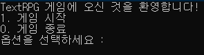
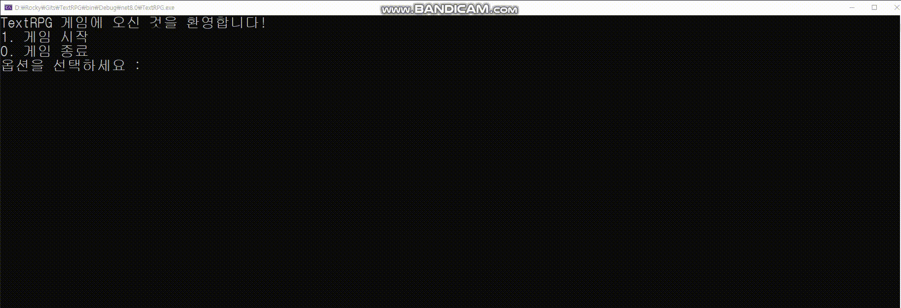
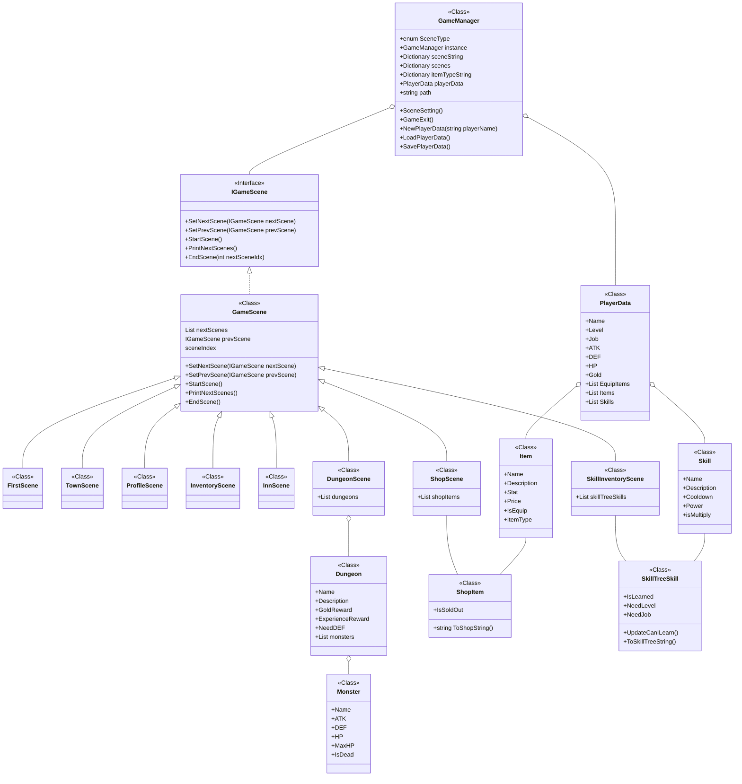

# 스파르타 내일배움캠프 유니티 11기 2주차 TextRPG

   
  
   

목차

## 프로젝트 소개

프로젝트 개요/동기

개인 프로젝트이지만 RPG의 기본적인 요소들을 다 갖추게 하고 싶었음.  
그래서 필수 과제와 도전 과제를 모두 해결한 후에도 스킬, 직업, 턴제 전투 등등을 추가적으로 제작하게 되었음.

 
  
   

 

## 기술 스택

| C# | .Net |
| :--------: | :--------: |
|   ![csharp]    |   ![dotnet]    |

 

## 구현 기능

### 게임 저장/불러오기 기능

PlayerData 클래스를 json으로 파싱하여 저장함.

### 인벤토리

보유하고있는 아이템을 확인할 수 있도록 하며,
아이템을 장착/해제할 수 있음.  
아이템 파츠를 나누어 두어, 이미 장착한 부분에 다른 아이템을 착용하고자 하면 이전에 착용한 아이템은 자동으로 착용해제됨.  
현재 머리, 몸통, 다리 방어구와 무기로 나누어 두었음.

### 스킬트리
레벨과 직업에 따라 스킬을 배울 수 있게 해 두었음.  
쿨타임 기능을 구현하여 던전에서 특정 쿨타임 턴이 지나야 사용할 수 있게끔 구현하였음.  
스킬 공격력이 합연산인지, 곱연산인지도 적혀있음.

### 상점
아이템 구매/판매를 진행할 수 있음.  
장착하고 있는 아이템의 경우에는 판매가 불가능 하도록 설정함.  
판매할 때에는 아이템의 가격이 구매가의 반 값으로 책정됨.  

### 던전
턴제 진행이 가능한 던전을 제작함.  
위에서 언급한 스킬을 사용할 수 있음.  
던전을 클리어하면 지정해둔 골드와 경험치를 얻을 수 있음.

 

## 배운 점 & 아쉬운 점

C#에서 클래스는 참조 형식이다..   
값을 가져다가 값을 변경해도 제대로 적용된다...  
그걸 생각을 못하고 일일히 GameManager.instance.playerData.... 이런식으로 접근하다보니 코드가 너무 길어졌다.  

 

## 개발 일지

### 소요 기간 : 2일

[TextRPG 개발 1일차](https://lhr4426.pages.dev/2025-%EC%8A%A4%ED%8C%8C%EB%A5%B4%ED%83%80-%EB%82%B4%EB%B0%B0%EC%BA%A0-%EC%9C%A0%EB%8B%88%ED%8B%B0-11%EA%B8%B0/%EB%B3%B8%EC%BA%A0%ED%94%84/%EB%82%B4%EC%9D%BC%EB%B0%B0%EC%9B%80%EC%BA%A0%ED%94%84-%EB%B3%B8%EC%BA%A0%ED%94%84---250708)

[TextRPG 개발 2일차](https://lhr4426.pages.dev/2025-%EC%8A%A4%ED%8C%8C%EB%A5%B4%ED%83%80-%EB%82%B4%EB%B0%B0%EC%BA%A0-%EC%9C%A0%EB%8B%88%ED%8B%B0-11%EA%B8%B0/%EB%B3%B8%EC%BA%A0%ED%94%84/%EB%82%B4%EC%9D%BC%EB%B0%B0%EC%9B%80%EC%BA%A0%ED%94%84-%EB%B3%B8%EC%BA%A0%ED%94%84---250709)

## 라이센스

MIT &copy; [NoHack](mailto:lbjp114@gmail.com)

<!-- Stack Icon Refernces -->

[csharp]: /images/Csharp.png
[dotnet]: /images/Dotnet.png

