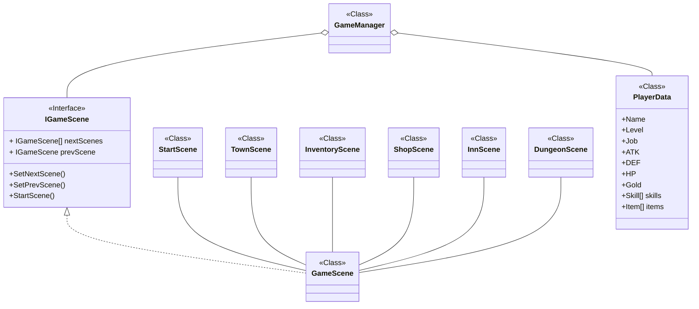

# TextRPG
스파르타 내일배움캠프 유니티 11기 2주차 TextRPG 제작

```mermaid
classDiagram
direction TB
    class StartScene {
    }

    class TownScene {
    }

    class InventoryScene {
    }

    class ShopScene {
    }

    class InnScene {
    }

    class DungeonScene {
    }

    class GameManager {
    }

    class IGameScene {
	    + IGameScene[] nextScenes
	    + IGameScene prevScene
	    +SetNextScene()
	    +SetPrevScene()
	    +StartScene()
    }

    class PlayerData {
	    +Name
	    +Level
	    +Job
	    +ATK
	    +DEF
	    +HP
	    +Gold
	    +Skill[] skills
	    +Item[] items
    }

    class GameScene {
    }

	<<Class>> StartScene
	<<Class>> TownScene
	<<Class>> InventoryScene
	<<Class>> ShopScene
	<<Class>> InnScene
	<<Class>> DungeonScene
	<<Class>> GameManager
	<<Interface>> IGameScene
	<<Class>> PlayerData
	<<Class>> GameScene

    GameManager o-- IGameScene
    GameManager o-- PlayerData
    IGameScene <|.. GameScene
    StartScene -- GameScene
    TownScene -- GameScene
    InventoryScene -- GameScene
    ShopScene -- GameScene
    InnScene -- GameScene
    DungeonScene -- GameScene


```
